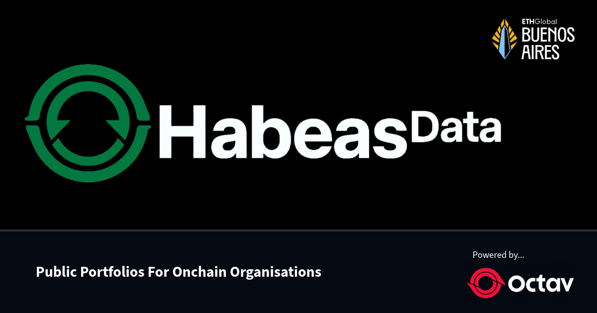
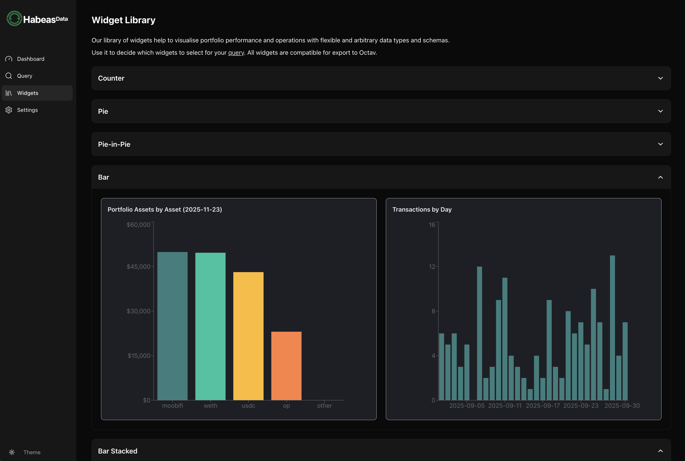
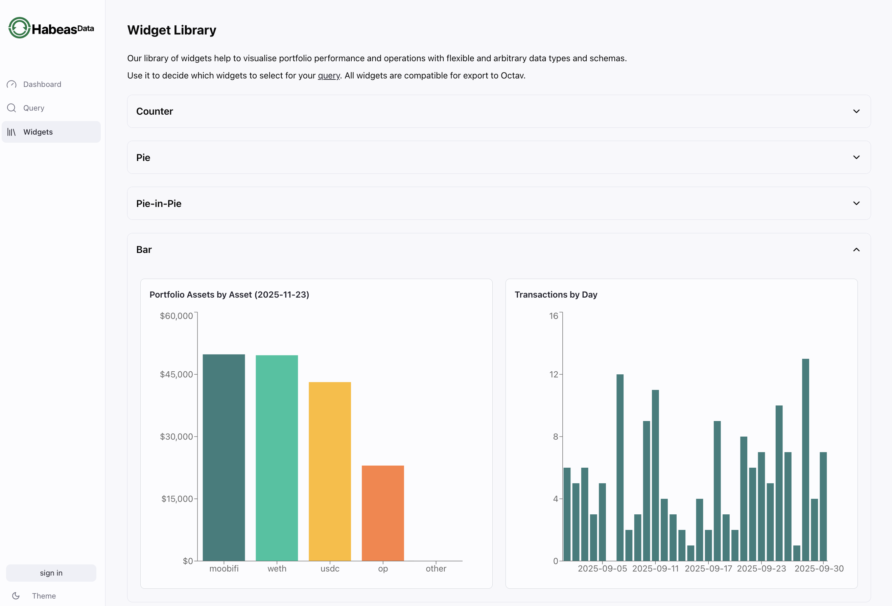
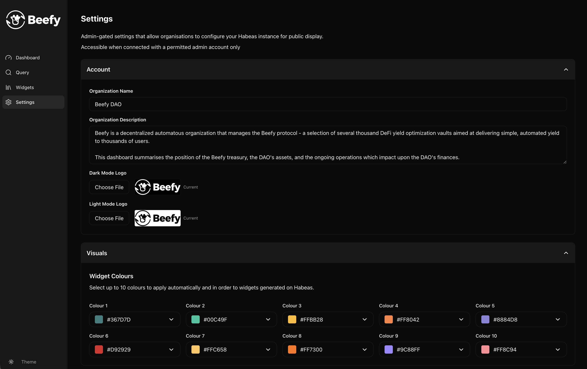

# Habeas Data



Habeas Data is a public-facing analytics application that extends Octav's portfolio data platform. It is designed to bridge the information gap between organizations, and their stakeholders and users.   

By leveraging Octav's comprehensive data, APIs and modular display unit (widgets), Habeas helps organizations build transparent, accessible dashboards, widgets and data to showcase their performance and operations. It empowers the organization's stakeholders access and customise real-time financial information through intuitive widgets, charts and tables, which can also be integrated into Octav or exported elsewhere.

Instances of the Habeas app are owned by user organisations, and configured to share appropriate data with the organisation's own users and stakeholders, while reflecting the organisation's own preferences and security practices. To ration API usage and cover the costs of operation, Habeas integrates the x402 payment standard, requiring users to make small onchain payments in Base USDC before querying widgets, tables or data.

> **Note:** This repository began as a fork of [x402-demo](https://github.com/Jnix2007/x402-demo) by Jnix2007, extended with additional features including portfolio integration via the Octav API.

**<details><summary>Project Screenshots</summary>**


**Screenshot 1**: Habeas provides analytics and insights by producing dashboards, widgets, tables and data based on Octav data. The application's widget library provides a comprehensive range of ways to understand portfolio performance and operations, expanding the transparency of its user organisations.



**Screenshot 2**: to enhance the flexibility and analytical utility of our widget designs, we integrated a custom query page that allows users to generate their own widgets (and/or underlying tables and data) with the parameters of their choice, provided they make a small payment to cover the cost of generation.



**Screenshot 3**: once logged in, admin users can access the settings page to configure their organisation's public-facing site, providing logos, descriptions, colour schemes and other visual cues to make Habeas' platform their own transparency tool.



**Screenshot 4**: the Dashboard page becomes the default access page for the organisation's stakeholders and users, but is the final product of setting up and utilising the the Habeas application's tools and services.


</details>

## Tech Stack

**client:**
- Next.js 15 with App Router
- React 19
- Tailwind CSS v4
- Shadcn UI
- TypeScript
- Radix UI primitives
- React Query (@tanstack/react-query) for data fetching
- Recharts for data visualization
- x402 payment protocol (x402-fetch)
- Coinbase Developer Platform (CDP) - Embedded Wallet
- Octav API for portfolio and transaction data
- Axios for HTTP requests
- Ethers.js for blockchain interactions
- Sonner for toast notifications
- html2canvas for widget export

**server:**
- Express.js
- Node.js
- TypeScript

## Quickstart

### Pre-requisites

1. **Node.js v18+** installed
2. **pnpm** installed (for client dependencies)
   - install with: `npm install -g pnpm`
3. **CDP Project** created at https://portal.cdp.coinbase.com/
4. **CDP API Key** for using CDP Facilitator, Faucet API, and Token Balances API
5. **wallet address** to receive payments (any Ethereum address)

### 1. install server dependencies

```bash
cd server
npm install
```

### 2. configure server

```bash
cp .env.example .env
```

edit your `server/.env`:
```env
RECEIVER_WALLET=0xYourWalletAddressHere
CDP_API_KEY_ID=your-api-key-id
CDP_API_KEY_SECRET=your-api-key-secret
PORT=3001
```

**get CDP API credentials:**
1. go to https://portal.cdp.coinbase.com/
2. navigate to API Keys
3. create new API key
4. copy the ID and Secret

### 3. start server

```bash
npm run dev:server
```

you should see:
```
🚀 x402 Demo Server running on http://localhost:3001
📝 Protected endpoint: http://localhost:3001/motivate
💰 Receiving payments at: 0xYourAddress
```

leave this terminal running

### 4. install client dependencies

open a new terminal:

```bash
cd client
pnpm install
```

> **Note:** This project uses `pnpm` as the package manager for the client. Make sure you have `pnpm` installed. If you don't have it, install it with `npm install -g pnpm`.

### 5. configure client

```bash
cp .env.local.example .env.local
```

edit your `client/.env.local`:
```env
NEXT_PUBLIC_CDP_PROJECT_ID=your-project-id-here
NEXT_PUBLIC_API_URL=http://localhost:3001

# Octav API Key (REQUIRED for Octav Portfolio API)
# Get your API key at https://data.octav.fi
OCTAV_API_KEY=your_octav_api_key_here
```

**get your CDP Project ID:**
1. go to https://portal.cdp.coinbase.com/
2. select your project from the dropdown
3. go to Settings
4. copy the Project ID

**get your Octav API Key:**
1. visit https://data.octav.fi
2. sign up or log in to your account
3. navigate to your API keys section
4. create a new API key or copy your existing one
5. add it to your `.env.local` file as `OCTAV_API_KEY`
6. ask the Octav team for Credits

**Important:** Never commit your `.env.local` file to version control. It's already included in `.gitignore`.

### 6. start client (in a new terminal)

```bash
cd client
pnpm run dev
```

> **Note:** The client uses `pnpm` for package management. Use `pnpm run dev` instead of `npm run dev:client`.

you should see:
```
✓ Ready in 2.5s
○ Local:        http://localhost:3000
```

### 7. try it

1. open http://localhost:3000
2. click "Connect Wallet" and choose your preferred sign-in method
3. complete authentication; CDP Embedded Wallet is created automatically
4. click "Faucet" to get free testnet USDC
5. click "Get Motivational Quote (0.01 USDC)"
6. watch the payment happen automatically
7. see your quote and transaction confirmation on Basescan

## Architecture

### Client (Next.js Application)

The **client** is a Next.js 15 application that serves as the frontend and includes:

- **Frontend UI**: React components for dashboards, widgets, charts, and tables
- **Next.js API Routes**: Server-side API endpoints (`/app/api/`) that act as a proxy layer, directly calling the Octav API with the API key stored securely on the server
- **Client Services**: React Query hooks and services that can fetch data either from:
  - Next.js API routes (preferred for production)
  - Express server proxy (optional, for development or additional features)
- **Widget System**: Modular, reusable components for displaying portfolio and transaction data
- **Settings Management**: Configuration interface for organization branding, addresses, and widget defaults
- **Data Export**: CSV export functionality for tables and widget downloads

The client handles all user interactions, data visualization, and provides a secure way to access Octav API data without exposing API keys to the browser.

### Server (Express/TypeScript)

The **server** (`server-ts/`) is an optional Express.js TypeScript application that provides:

- **Octav API Proxy**: Middleware layer that proxies requests to the Octav API
- **Response Aggregation**: Combines data from multiple addresses into unified responses
- **Caching**: Optional caching layer for improved performance
- **Error Handling**: Centralized error handling and response formatting
- **x402 Payment Integration**: Legacy payment processing functionality (from original x402-demo fork)

The server runs on port 3001 and provides endpoints like `/api/octav/portfolio`, `/api/octav/historical`, and `/api/octav/transactions`. While the client can work standalone using Next.js API routes, the Express server offers additional features like response aggregation and caching for multiple address queries.

### Data Flow

1. **User interacts** with the Next.js client (dashboard, query page, widgets)
2. **Client services** make requests to either:
   - Next.js API routes (`/api/portfolio`, `/api/historical`, `/api/transactions`) → Direct to Octav API
   - Express server (`http://localhost:3001/api/octav/*`) → Proxy to Octav API
3. **Octav API** returns portfolio, historical, or transaction data
4. **Data is processed** and displayed in widgets, charts, or tables
5. **Users can export** data as CSV or download widget images

## Octav Integrations

The client includes integration with the [Octav Portfolio API](https://docs.octav.fi/api/endpoints/portfolio) to fetch and display portfolio data for blockchain addresses.

### Octav API Endpoints

Habeas utilizes three primary Octav API endpoints:

- **Portfolio API** (`/portfolio`): Fetches current portfolio data including net worth, asset allocations, protocol positions, and chain summaries for one or more wallet addresses. Supports optional parameters for including images, explorer URLs, NFTs, and waiting for data synchronization.

- **Historical API** (`/historical`): Retrieves portfolio snapshots for specific dates, enabling time-based analysis and comparison. Supports both single date queries and date range queries for tracking portfolio evolution over time.

- **Transactions API** (`/transactions`): Provides detailed transaction data within specified date ranges, including transaction types, protocols, networks, and filtering options. Enables analysis of treasury operations, spending patterns, and transaction volumes.

## Widgets

Habeas empowers users to customize widgets across a wide range of parameters and various different graphical designs. Each widget can be configured with specific addresses, date ranges, categories, and visual styling to create tailored analytics dashboards that meet unique organizational needs.

### Available Widget Types

**Counter Widgets:**
- Portfolio Net Worth - Current portfolio value display
- Historical Net Worth - Portfolio value at a specific date
- Transaction Count - Number of transactions within a date range

**Pie Charts:**
- Current Portfolio by Asset - Asset allocation breakdown
- Current Portfolio by Protocol - Protocol distribution
- Historical Portfolio by Asset - Historical asset allocation
- Historical Portfolio by Protocol - Historical protocol distribution

**Pie-in-Pie Charts:**
- Portfolio by Asset - Nested pie chart showing asset categories
- Portfolio by Protocol - Nested pie chart showing protocol categories

**Bar Charts:**
- Current Portfolio by Asset - Asset comparison bars
- Current Portfolio by Protocol - Protocol comparison bars
- Historical Portfolio by Asset - Historical asset trends
- Historical Portfolio by Protocol - Historical protocol trends
- Portfolio by Net Worth - Net worth progression over time
- Transactions by Day - Daily transaction volume

**Bar Stacked Charts:**
- Portfolio by Asset - Stacked asset composition over time
- Portfolio by Protocol - Stacked protocol composition over time

All widgets support customization of addresses, date ranges, categories, color schemes, and can be exported as images or integrated into external dashboards.

The project makes use of:

- [Portfolio API](https://docs.octav.fi/api/endpoints/portfolio)
- [API Access & Pricing](https://api-docs.octav.fi/getting-started/api-access)
- [Get an API Key](https://data.octav.fi)
- [Supported Chains](https://docs.octav.fi/api/reference/supported-chains)
- [Protocol Types](https://docs.octav.fi/api/reference/protocol-types)

## CDP Integrations

This project uses **four CDP products**:

| CDP product | purpose | used in | auth details |
|-------------|---------|---------|---------------|
| **Embedded Wallet** | user auth & wallet creation | client | CDP Project ID only |
| **x402 Facilitator** | payment verification & settlement | server | CDP API Key |
| **Faucet API** | distribute testnet USDC | server | CDP API Key |
| **Token Balances API** | check USDC balances | server | CDP API Key |

## Learn More

**Octav:**
- [Octav API Documentation](https://api-docs.octav.fi)
- [Portfolio API](https://docs.octav.fi/api/endpoints/portfolio)

**x402 & CDP:**
- [CDP Facilitator docs](https://docs.cdp.coinbase.com/x402)
- [CDP Embedded Wallet docs](https://docs.cdp.coinbase.com/embedded-wallets)
- [CDP x402 Facilitator API reference](https://docs.cdp.coinbase.com/api-reference/v2/rest-api/x402-facilitator/x402-facilitator)
- [x402 GitHub repo](https://github.com/coinbase/x402)

**Technologies:**
- [Next.js Documentation](https://nextjs.org/docs)
- [React Query Documentation](https://tanstack.com/query/latest)
- [Shadcn Documentation](https://ui.shadcn.com/)
- [Tailwind CSS Documentation](https://tailwindcss.com/docs)