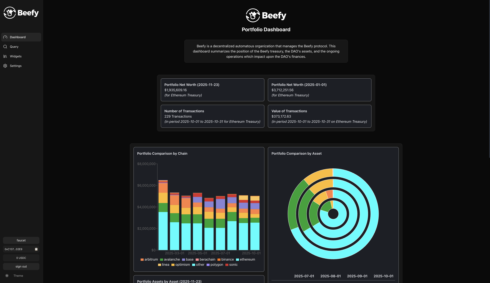

# Habeas Client

A Next.js 15 analytics application for building transparent, accessible financial dashboards and widgets powered by the Octav Portfolio API.

> **Note:** This is part of the **Habeas Data** project. For the optional backend server, see [habeas-server](https://github.com/iamjackgale/habeas-server).

## Overview

Habeas Client is a public-facing analytics application that extends Octav's portfolio data platform. It is designed to bridge the information gap between organizations and their stakeholders by providing:

- **Interactive Dashboards**: Real-time portfolio analytics and insights
- **Customizable Widgets**: Modular, reusable components for displaying portfolio and transaction data
- **Data Visualization**: Charts, tables, and reports for portfolio performance analysis
- **Organization Branding**: Configurable interface reflecting organization identity and preferences
- **User Authentication**: Seamless wallet integration via Coinbase Developer Platform (CDP)
- **x402 Payments**: Secure payment functionality for API access
- **Data Export**: CSV export and widget image downloads
- **Organization Settings**: Admin interface for configuring addresses, branding, and widget defaults

Habeas empowers organizations to showcase their financial performance and operations with transparency, allowing stakeholders to access and customize real-time financial information through intuitive widgets and charts.

**<details><summary>Screenshots</summary>**

**Screenshot 1**: Habeas provides analytics and insights by producing dashboards, widgets, tables and data based on Octav data. The application's widget library provides a comprehensive range of ways to understand portfolio performance and operations, expanding the transparency of its user organisations.


**Screenshot 2**: To enhance the flexibility and analytical utility of our widget designs, we integrated a custom query page that allows users to generate their own widgets (and/or underlying tables and data) with the parameters of their choice, provided they make a small payment to cover the cost of generation.


**Screenshot 3**: Once logged in, admin users can access the settings page to configure their organisation's public-facing site, providing logos, descriptions, colour schemes and other visual cues to make Habeas their own transparency tool.


**Screenshot 4**: The Dashboard page becomes the default access page for the organisation's stakeholders and users, but is the final product of setting up and utilising the Habeas application's tools and services.



</details>

## Tech Stack

- **Next.js 15** - React framework with App Router
- **React 19** - UI library
- **TypeScript** - Type-safe JavaScript
- **Tailwind CSS v4** - Utility-first CSS framework
- **Shadcn UI** - High-quality React components
- **Radix UI** - Unstyled, accessible primitives
- **React Query (@tanstack/react-query)** - Server state management
- **Recharts** - Data visualization library
- **x402-fetch** - x402 payment protocol client
- **Coinbase Developer Platform (CDP)** - Embedded wallet authentication
- **Ethers.js** - Blockchain interactions
- **Axios** - HTTP client
- **Sonner** - Toast notifications
- **html2canvas** - Widget export to images

## Prerequisites

1. **Node.js v18+** installed
2. **pnpm** installed (package manager for this project)
   - Install with: `npm install -g pnpm`
3. **CDP Project** created at https://portal.cdp.coinbase.com/
4. **Octav API Key** from https://data.octav.fi

## Quick Start

### 1. Install Dependencies

```bash
pnpm install
```

### 2. Configure Environment

Copy the example environment file:

```bash
cp .env.local.example .env.local
```

Edit your `.env.local`:
```env
NEXT_PUBLIC_CDP_PROJECT_ID=your-project-id-here
NEXT_PUBLIC_API_URL=http://habeas-server.vercel.app

# Octav API Key (REQUIRED for Octav Portfolio API)
# Get your API key at https://data.octav.fi
OCTAV_API_KEY=your_octav_api_key_here
```

**Get your CDP Project ID:**
1. Go to https://portal.cdp.coinbase.com/
2. Select your project from the dropdown
3. Go to Settings
4. Copy the Project ID

**Get your Octav API Key:**
1. Visit https://data.octav.fi
2. Sign up or log in to your account
3. Navigate to your API keys section
4. Create a new API key or copy your existing one
5. Request API credits from the Octav team

**Important:** Never commit your `.env.local` file to version control. It's already included in `.gitignore`.

### 3. Start Development Server

```bash
pnpm run dev
```

You should see:
```
✓ Ready in 2.5s
○ Local:        http://localhost:3000
```

Open [http://localhost:3000](http://localhost:3000) to view the application.

### 4. Try It Out

1. Open http://localhost:3000
2. Click "Connect Wallet" and choose your preferred sign-in method
3. Complete authentication (CDP Embedded Wallet is created automatically)
4. Explore the dashboard, query page, and widget library
5. Create custom widgets with your preferred parameters

## Scripts

- `pnpm run dev` - Start development server with Turbopack
- `pnpm run build` - Build for production
- `pnpm run start` - Run production server
- `pnpm run lint` - Run ESLint

## Features

### Dashboards & Widgets

Habeas provides a comprehensive widget library for portfolio analytics:

**Counter Widgets:**
- Portfolio Net Worth - Current portfolio value display
- Historical Net Worth - Portfolio value at a specific date
- Transaction Count - Number of transactions within a date range

**Pie Charts:**
- Current Portfolio by Asset - Asset allocation breakdown
- Current Portfolio by Protocol - Protocol distribution
- Historical Portfolio by Asset - Historical asset allocation
- Historical Portfolio by Protocol - Historical protocol distribution

**Pie-in-Pie Charts:**
- Portfolio by Asset - Nested pie chart showing asset categories
- Portfolio by Protocol - Nested pie chart showing protocol categories

**Bar Charts:**
- Current Portfolio by Asset - Asset comparison bars
- Current Portfolio by Protocol - Protocol comparison bars
- Historical Portfolio by Asset - Historical asset trends
- Historical Portfolio by Protocol - Historical protocol trends
- Portfolio by Net Worth - Net worth progression over time
- Transactions by Day - Daily transaction volume

**Bar Stacked Charts:**
- Portfolio by Asset - Stacked asset composition over time
- Portfolio by Protocol - Stacked protocol composition over time

All widgets support:
- Custom address selection
- Date range filtering
- Category filtering
- Color scheme customization
- Export as image
- CSV data export

### Query Builder

Users can create custom widgets with full control over:
- Blockchain addresses
- Date ranges and time intervals
- Categories and data filters
- Visual styling and colors
- Widget type and layout

### Organization Settings

Admin users can configure:
- Organization name and description
- Logo and branding assets
- Color palette and theme
- Treasury addresses across multiple chains
- Widget defaults and presets

### Octav API Integration

The client integrates with three primary Octav API endpoints:

- **Portfolio API**: Current portfolio data including net worth, asset allocations, protocol positions, and chain summaries for one or more addresses
- **Historical API**: Portfolio snapshots for specific dates, enabling time-based analysis and comparison
- **Transactions API**: Detailed transaction data within date ranges, including types, protocols, and networks

## Architecture

The client consists of several key layers:

### Pages & Routes
- **Dashboard** - Main portfolio overview
- **Widgets** - Widget library and showcase
- **Query** - Custom widget builder
- **Reports** - Analytics and reporting
- **Settings** - Organization configuration

### Components
- **Widgets** - Self-contained, configurable data visualization components
- **Charts** - Recharts-based visualizations (bar, pie, stacked)
- **Tables** - Data tables with sorting, filtering, and export
- **Dropdowns** - Query parameter selectors (address, dates, categories)
- **Header & Sidebar** - Navigation and app structure

### Services
- **Octav Services** - React Query hooks for portfolio, historical, and transaction data
- **API Routes** - Next.js server-side API routes (`/app/api/`) that proxy to Octav API
- **Data Handlers** - Business logic for data processing and transformation

### Utilities
- **Time Interval Utils** - Date range and interval calculations
- **Table CSV Extractor** - CSV export functionality
- **Widget Download** - Image export for widgets
- **Data Renderer** - Format and render data for display

### Hooks
- `useCategories` - Load transaction categories from config
- `useWidgetDefaults` - Get default widget configurations
- `useWidgetColors` - Access color scheme configuration
- `usePaymentRequirement` - Check x402 payment requirements
- `useMobile` - Responsive design helpers

## Configuration

The client reads configuration from `config.json` which defines:

- Organization settings (name, description)
- Widget colors and branding
- Supported blockchain addresses
- Widget default parameters
- Transaction categories and types
- x402 payment requirements

This configuration is loaded via the `/api/settings` endpoint and can be updated at runtime.

## API Routes

The client includes Next.js API routes that serve as a proxy layer:

```
/app/api/
├── portfolio/        - Portfolio data endpoint
├── historical/       - Historical data endpoint
├── transactions/     - Transaction data endpoint
├── settings/         - Configuration endpoint
├── logos/            - Organization logos
└── favicon/          - Favicon configuration
```

These routes:
- Store the Octav API key securely on the server
- Proxy requests to the Octav API
- Handle errors and data transformation
- Support CORS for frontend requests

## Payment Integration

The client integrates the x402 payment standard for API access control:

- **Embedded Wallet**: Users authenticate and hold testnet USDC
- **Payment Flow**: Widget queries require small USDC payments
- **Base Sepolia**: Testnet network for development and testing

## Performance Optimization

- **Turbopack**: Fast development builds
- **Server-Side Rendering**: Improved initial page load
- **React Query**: Efficient data fetching and caching
- **Image Optimization**: Next.js image components
- **Code Splitting**: Automatic route-based code splitting

## Data Flow

1. **User interacts** with the Next.js client (dashboard, query page, widgets)
2. **Client services** make requests via:
   - Next.js API routes (`/api/*`) - Proxy to Octav API with secure key storage
   - React Query - Handles caching, refetching, and state management
3. **Octav API** returns portfolio, historical, or transaction data
4. **Data is processed** by handlers and formatted for widgets
5. **Widgets render** charts, tables, and statistics
6. **Users can export** data as CSV or download widget images

## Optional: Backend Server

For additional features like response aggregation and caching across multiple addresses, you can deploy the optional [habeas-server](https://github.com/iamjackgale/habeas-server):

- Points `NEXT_PUBLIC_API_URL` to the Express server
- Server provides `/api/octav/*` endpoints with aggregation and caching
- Client automatically routes requests through the server

## Project Structure

```
habeas-client/
├── app/                          # Next.js app directory
│   ├── layout.tsx               # Root layout
│   ├── page.tsx                 # Home page
│   ├── api/                     # API routes
│   ├── dashboard/               # Dashboard page
│   ├── query/                   # Query builder page
│   ├── reports/                 # Reports page
│   ├── settings/                # Settings page
│   └── widget/                  # Widget showcase page
├── components/                   # React components
│   ├── widgets/                 # Widget components
│   ├── charts/                  # Chart components
│   ├── tables/                  # Table components
│   ├── query-dropdowns/         # Query parameter selectors
│   ├── settings/                # Settings UI
│   ├── header/                  # Header component
│   ├── app-sidebar/             # Navigation sidebar
│   └── ui/                      # Shadcn UI components
├── handlers/                     # Data processing logic
│   ├── portfolio-handler.ts
│   ├── category-handler.ts
│   └── pie-chart-handler.ts
├── hooks/                        # React hooks
│   ├── use-categories.ts
│   ├── use-widget-defaults.ts
│   └── use-widget-colors.ts
├── lib/                          # Utilities
│   ├── data-renderer.tsx
│   ├── table-csv-extractor.ts
│   ├── widget-download.ts
│   └── time-interval-utils.ts
├── services/                     # API services
│   └── octav/                   # Octav API integration
├── types/                        # TypeScript types
│   ├── portfolio.ts
│   ├── transaction.ts
│   └── portfolio-download.ts
├── public/                       # Static assets
│   ├── habeas-logos/
│   ├── org-logos/
│   └── screenshots/
├── config.json                   # Application configuration
├── .env.local.example            # Environment variables template
├── tsconfig.json                 # TypeScript configuration
├── next.config.ts                # Next.js configuration
├── tailwind.config.js            # Tailwind CSS configuration
└── package.json                  # Dependencies
```

## Learning Resources

**Octav:**
- [Octav API Documentation](https://api-docs.octav.fi)
- [Portfolio API Reference](https://docs.octav.fi/api/endpoints/portfolio)
- [Supported Chains](https://docs.octav.fi/api/reference/supported-chains)
- [Protocol Types](https://docs.octav.fi/api/reference/protocol-types)

**Next.js & React:**
- [Next.js Documentation](https://nextjs.org/docs)
- [React Documentation](https://react.dev)
- [Next.js App Router](https://nextjs.org/docs/app)

**UI & Styling:**
- [Shadcn UI Documentation](https://ui.shadcn.com/)
- [Tailwind CSS Documentation](https://tailwindcss.com/docs)
- [Radix UI Documentation](https://www.radix-ui.com/docs/primitives/overview/introduction)

**Data & Queries:**
- [React Query Documentation](https://tanstack.com/query/latest)
- [Recharts Documentation](https://recharts.org/)

**Authentication & Payment:**
- [CDP Embedded Wallet Docs](https://docs.cdp.coinbase.com/embedded-wallets)
- [x402 GitHub Repo](https://github.com/coinbase/x402)
- [Coinbase Developer Platform Docs](https://docs.cdp.coinbase.com/)

## License

MIT
